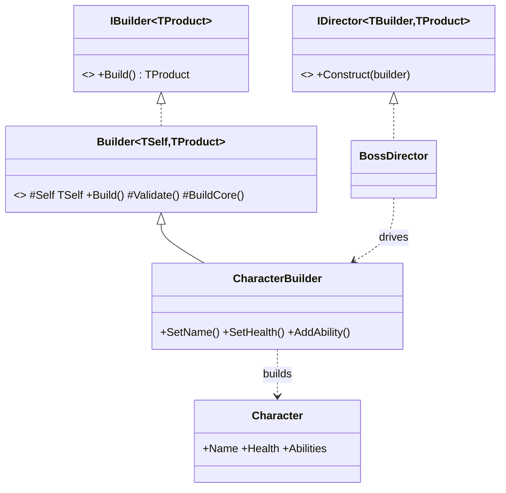

# Builder Pattern

> Assemble a complex object step by step, then hand back a finished, validated, immutable product — no telescoping constructors, no half-built objects.

## Intent

Some objects have many optional parts (a character with stats, abilities, loot; a request with headers, body, timeouts). Passing them all through constructors leads to unreadable `new Character(null, 100, 2.5f, null, ..., true, false)` calls. The Builder collects the parts through named, chainable methods and produces the object in one `Build()` call — validating first, so you never get a malformed product.



## Structure

| Folder | Assembly | Contents |
|---|---|---|
| `Core/` | `DesignPatterns.Builder` | The generic pattern — pure C#, `noEngineReferences: true`. |
| `Sample/` | `DesignPatterns.Builder.Sample` | Character builder + enemy-preset directors + playable demo. |
| `Tests/` | `DesignPatterns.Builder.Tests` | 16 EditMode tests (Window → General → Test Runner). |

**Core participants:**

- `IBuilder<TProduct>` — the target contract: `Build()` returns a finished product.
- `Builder<TSelf, TProduct>` — the generic fluent base. `Build()` is a template method: it runs `Validate()`, throws `BuilderValidationException` (with *all* errors) if anything failed, otherwise returns `BuildCore()`. Subclasses implement only `Validate()` + `BuildCore()`.
- `IDirector<TBuilder, TProduct>` — encapsulates a reusable construction recipe (a preset).
- `BuilderValidationException` — carries `IReadOnlyList<string> Errors`.

## The generic trick: CRTP

The base is declared `Builder<TSelf, TProduct> where TSelf : Builder<TSelf, TProduct>` — a type that refers to its own subclass (the *curiously recurring template pattern*). It exposes `protected TSelf Self => (TSelf)this;`, so a fluent method in a subclass writes `return Self;` and the caller keeps the **concrete** builder type through the whole chain:

```csharp
Character hero = new CharacterBuilder()
    .SetName("Hero")     // returns CharacterBuilder, not Builder<,>
    .SetHealth(120)      // so SetHealth is visible here
    .SetSpeed(2.5f)
    .AddAbility("Dash")
    .Build();
```

Without CRTP, `SetName()` would return the base type and the next `.SetHealth()` wouldn't compile. This is what lets the reusable base host the fluent chaining while subclasses add methods with zero boilerplate overrides.

## Fluent builder vs Director

- **Fluent builder** — the caller decides the configuration inline. Best for one-off or varying objects.
- **Director** — a canned recipe for a *specific* configuration, reused across the codebase. `GruntDirector`, `ArcherDirector`, and `BossDirector` each drive a fresh `CharacterBuilder` and return a finished preset. Change the recipe once, every spawn updates.

Both use the same builder; they answer different questions ("build whatever I describe" vs "build the standard Boss").

## Run the sample

Open `Sample/Scenes/BuilderSample.unity` and press Play. The Console shows a custom fluently-built character, the three director presets, and a deliberately invalid build whose `BuilderValidationException` is caught and its errors logged.

## When to use it in games

- **Config-heavy objects** — enemies, weapons, levels, dialogue nodes with many optional fields.
- **Presets/variants** — directors capture "the standard X" so spawn code stays clean.
- **Test data builders** — `new CharacterBuilder().SetName("t").Build()` gives a valid default you tweak per test (this repo's own tests do exactly that).
- **Immutable results** — build once, then the object can be shared freely without defensive copying.

## Pitfalls

- **Telescoping constructors** are the anti-pattern Builder replaces — if you see `new Thing(a, b, null, null, true)`, reach for a builder.
- **Mutable-after-build leaks** — the product must copy collections it's given (this `CharacterBuilder` does `.ToArray()`), or later builder mutation silently changes an already-built object. There's a test for exactly this.
- **A Director that does too much** — directors describe *a* configuration; they shouldn't contain business logic, spawn objects, or touch the scene. Keep them recipe-only.
- **Validating too late** — validate in `Build()`, not scattered across setters, so a builder can be configured in any order and only checked when it matters.
- **Reusing a builder expecting a fresh product** — this builder accumulates (calling `AddAbility` twice adds two). If you want independent products, use a fresh builder (as the directors do).
