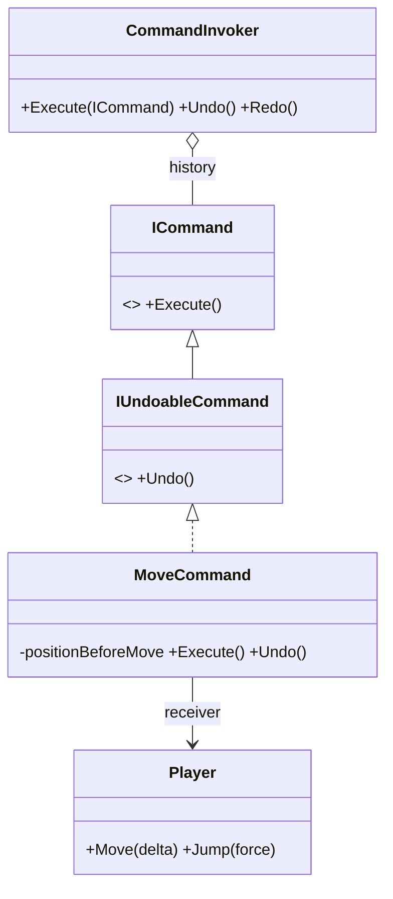

# Command Pattern

> Turn an action into an object, so the thing that *triggers* work is decoupled from the thing that *does* it.

## Intent

Instead of calling `player.Jump()` directly from input code, wrap the call in a command object with a uniform `Execute()` method. Whoever executes commands (the **invoker**) needs no knowledge of what they do or whom they act on — which unlocks key rebinding, undo/redo, macros, replays, and AI/network-driven actions for free.

## Structure

| Folder | Assembly | What lives here |
|---|---|---|
| `Core/` | `DesignPatterns.Command` | The reusable pattern — pure C#, `noEngineReferences: true` proves it has zero Unity dependency. |
| `Sample/` | `DesignPatterns.Command.Sample` | A playable demo wiring the pattern to Unity input, physics and objects. |
| `Tests/` | `DesignPatterns.Command.Tests` | EditMode tests for the Core (Window → General → Test Runner). |

**Core participants:**

- `ICommand` / `IUndoableCommand` — the contracts. Undo is a *separate* interface because not every action can be reverted (a physics impulse, a network call).
- `Command<TReceiver>` / `UndoableCommand<TReceiver>` — generic bases that keep concrete commands strongly typed to their receiver.
- `CommandInvoker` — executes commands and owns the undo/redo history. Only undoable commands are recorded; a new action clears the redo branch.
- `RelayCommand` / `RelayCommand<TContext>` — commands from lambdas, for one-off actions that don't deserve a class.
- `CompositeCommand` — a macro: executes children in order, undoes them in reverse as a single history entry.

## Run the sample

Open `Sample/Scenes/CommandSample.unity` and press Play:

| Key | Action | In the pattern |
|---|---|---|
| WASD | Move one step | `MoveCommand` — undoable, captures its previous position |
| Space | Jump | `JumpCommand` — deliberately **not** undoable |
| C | Dash (two steps) | `CompositeCommand` — undoes as one entry |
| P | Reset to spawn | `RelayCommand<Player>` — lambda command |
| Z / Y | Undo / Redo | `CommandInvoker` history |

Try: move a few times, jump, then hold Z — moves rewind one by one, and the jump is skipped because it never entered the history.

## When to use it in games

- **Input rebinding** — keys map to command *factories*; swapping controls is a dictionary write (see `InputHandler`).
- **Undo/redo** — level editors, turn-based games, puzzle rewind.
- **Macros & combos** — compose commands into bigger commands.
- **Replays & networking** — a recorded command stream *is* a replay file / network message.
- **AI orders** — the same `MoveCommand` works whether a keyboard, an AI planner, or a cutscene script issued it.

## Pitfalls

- **Shared command instances break undo.** An undoable command must capture state at `Execute()` time (here: the position before moving), so it needs a fresh instance per invocation. The legacy sample in this repo reused five singleton commands and its undo silently did nothing — the featured bug this rewrite fixes.
- **Not everything is undoable.** Model that honestly with a separate interface instead of empty `Undo()` bodies that lie to the history.
- **Undo/redo are not commands.** They are requests *to the invoker*; turning them into commands puts history manipulation inside the history.
