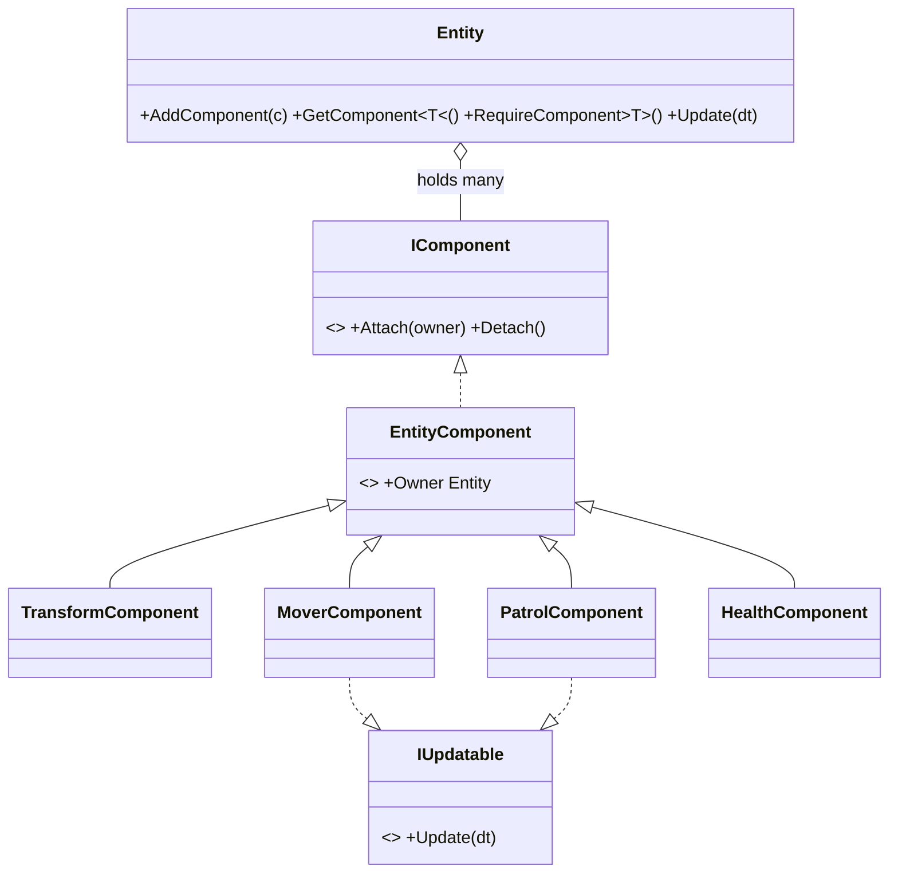

# Component Pattern

> Build an entity by composing small single-domain parts instead of growing a deep class hierarchy.

## Intent

A game entity needs to move, be damaged, be rendered, run AI… If you model that with inheritance you end up with `MovingDamageableRenderedEnemy` and a combinatorial mess. The Component pattern makes the entity a **container**: each behavior is a self-contained component owning one domain, and you assemble an entity from whatever components it needs — at runtime, in any mix.

## This *is* how Unity works

Unity's `GameObject` + `MonoBehaviour` is the Component pattern: `AddComponent<T>()`, `GetComponent<T>()`, and an engine-driven `Update()` loop are exactly this `Entity`. Building it from scratch here shows the mechanics Unity hides — and clarifies that adding a `MonoBehaviour` to a GameObject *is* applying this pattern. In real Unity code you'd use the engine's system, not this one; the value here is understanding it.

## Structure

| Folder | Assembly | Contents |
|---|---|---|
| `Core/` | `DesignPatterns.Component` | The generic entity/component container — pure C#, `noEngineReferences: true`. |
| `Sample/` | `DesignPatterns.Component.Sample` | A patrolling "Guard" entity assembled from four components + a playable demo. |
| `Tests/` | `DesignPatterns.Component.Tests` | 17 EditMode tests (Window → General → Test Runner). |

**Core participants:**

- `Entity` — the container: `AddComponent`, `GetComponent`/`TryGetComponent`/`HasComponent`/`RequireComponent`, `RemoveComponent`, and an `Update(dt)` that ticks every `IUpdatable` component in add order (over a snapshot, so a component can add/remove others mid-tick).
- `IComponent` — the capability contract (`Attach`/`Detach` lifecycle the entity drives).
- `EntityComponent` — base that tracks the owning `Entity`, so a component reaches siblings via `Owner.GetComponent<T>()` rather than holding hard references.
- `IUpdatable` — the per-frame capability; passive components simply don't implement it and cost nothing per tick.

## Components collaborate through the owner

The sample splits movement into two domains that never reference each other's classes:

- `PatrolComponent` (AI) decides a velocity and writes it to the shared `TransformComponent`.
- `MoverComponent` (integration) reads that velocity and advances the position.
- `HealthComponent` is an unrelated domain living on the same entity.

Each finds what it needs with `Owner.RequireComponent<TransformComponent>()` — resolved lazily so add-order doesn't matter. Decoupling through the owner is what lets you drop a component in or pull one out without the others noticing.

## Run the sample

Open `Sample/Scenes/ComponentSample.unity` and press Play. A capsule (following the entity's `TransformComponent`) patrols between two points. Press **Space** to damage the guard; when its health reaches zero the demo `RemoveComponent`s the patrol and mover at runtime and it stops where it fell — behavior removed by composition, no `if (dead)` branches sprinkled through a movement class.

## When to use it in games

- **Entities with mix-and-match behavior** — enemies, pickups, props sharing a component vocabulary (Health, Mover, AI, Loot) in different combinations.
- **Runtime capability changes** — add a `StunComponent`, remove a `MoverComponent`, swap AI — without touching a class hierarchy.
- **Data-driven entities** — build entities from a config/asset that lists components (this is what ECS and Unity prefabs generalize).
- **Decoupling domains** — physics, rendering, and input evolve independently when each is its own component.

## Pitfalls

- **Reinventing Unity's wheel** — in a real Unity project, `MonoBehaviour` already gives you this. Hand-roll an entity system only when you have a reason the engine's doesn't serve (pure-C# simulation, custom update ordering, ECS-style data layout).
- **Components reaching into each other's internals** — collaborate through shared state (a `TransformComponent`) or messages, not by poking another component's private fields, or you rebuild the coupling the pattern removed.
- **Hidden update-order dependence** — if component A must tick before B, that ordering is easy to break. Make it explicit (add order here) or design components not to care.
- **God components** — a `PlayerComponent` that does movement + health + inventory is the hierarchy problem wearing a component costume. Keep each component to one domain.
- **Fat entity base classes** — put behavior in components, not in a giant `Entity` subclass; the entity should stay a thin container.
