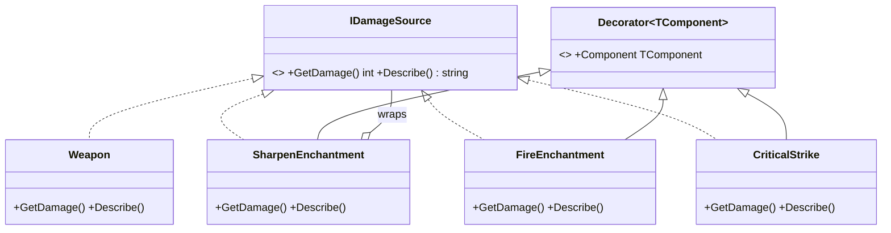

# Decorator Pattern

> Add responsibilities to an object by wrapping it, one layer at a time — a flexible alternative to a subclass for every combination.

## Intent

You want a weapon that's sharpened, *and* fiery, *and* can crit. Subclassing gives you a combinatorial explosion (`SharpFireCritSword`, `FireCritSword`, …). The Decorator pattern instead lets each responsibility be its own wrapper that implements the same interface as the thing it wraps, so you compose them at runtime in any combination and any order.

Each enchantment **is-a** `IDamageSource` (so callers treat it like any other) and **has-a** `IDamageSource` (the thing it wraps). That dual nature is what lets them nest.

## Structure

| Folder | Assembly | Contents |
|---|---|---|
| `Core/` | `DesignPatterns.Decorator` | The generic pattern — pure C#, `noEngineReferences: true`. |
| `Sample/` | `DesignPatterns.Decorator.Sample` | A weapon-damage pipeline with stackable enchantments + a playable demo. |
| `Tests/` | `DesignPatterns.Decorator.Tests` | 13 EditMode tests (Window → General → Test Runner). |

**Core participants:**

- `Decorator<TComponent>` — the reusable base: it stores the wrapped `Component` and null-checks it, so every concrete decorator skips that boilerplate. A subclass derives from it *and* implements the component interface, forwarding to `Component` and augmenting the result.
- `IDecorator<TComponent>` — exposes the wrapped component so a chain can be inspected or unwrapped (handy in tests and debugging).

The base is generic, so it serves decorators of **any** interface — the tests prove it by decorating both `IDamageSource` and an unrelated `IGreeter`.

## Run the sample

Open `Sample/Scenes/DecoratorSample.unity` and press Play. The Console shows:
- a base `Sword` (10),
- `CriticalStrike(Fire(Sharpen(Sword)))` → `((10 + 3) + 5) × 2 = 36`,
- **order matters**: `Crit(Sharpen(Axe))` = 26 vs `Sharpen(Crit(Axe))` = 23 — because crit multiplies whatever sits below it,
- the same decorator stacked twice (double Fire).

## Decorator vs the alternatives

- **vs subclassing** — decorators compose at runtime; subclasses are fixed at compile time and multiply with every combination.
- **vs Adapter** — an adapter *changes* an interface to a different one; a decorator *keeps the same* interface and adds behavior.
- **vs a plain wrapper/Facade** — a facade simplifies or hides; a decorator is transparent (same interface) and stackable.

## When to use it in games

- **Stackable modifiers** — weapon enchantments, buffs/debuffs, damage-over-time layered on a base value.
- **I/O and data pipelines** — buffering → compression → encryption wrapping a stream (the pattern's classic real-world home).
- **UI/text pipelines** — timestamp → prefix → color wrapping a log or chat line.
- **Runtime opt-in behavior** — logging, caching, or validation wrapped around a service without touching it.

## Pitfalls

- **A decorator that changes the interface** is an Adapter, not a Decorator — keep the same contract so wrappers stay interchangeable and nestable.
- **Order-dependence surprises** — multiplicative and additive decorators give different totals depending on nesting (the demo shows this). Decide and document the intended order.
- **Deep chains hurt debuggability** — ten wrappers make a stack trace and a step-through painful; `IDecorator.Component` lets you unwrap, but don't over-layer.
- **Identity is lost** — the outermost decorator is not `==` the base object, and reference equality / type checks against the concrete type fail. Don't rely on them through a chain.
- **A void-returning "decorator" demonstrates nothing** — the legacy version this replaced wrapped `SetDamage()` returning `void`, so no composition was visible. If wrapping doesn't observably transform a result or behavior, it isn't earning the pattern.
