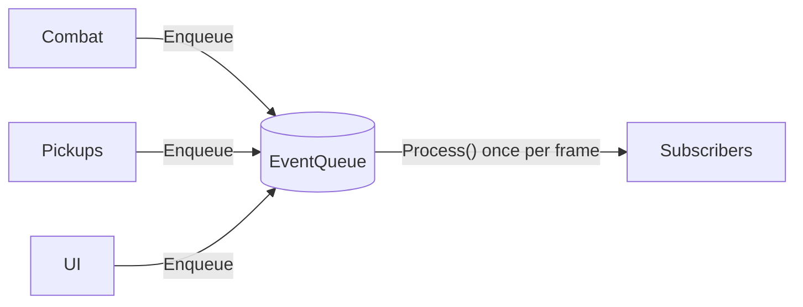

# Event Queue Pattern

> Decouple *when* a message is sent from *when* it's handled — buffer events now, process them later.

## Intent

Observer decouples sender from receiver in *space* (the sender doesn't know who listens) but everything still runs synchronously, right now, on the sender's call stack. An **Event Queue** adds decoupling in *time*: producers drop events into a queue and return immediately; a processor drains the queue later, usually once per frame. That buys you batching, ordering control, load-spreading across frames, and a place to merge or filter requests — at the cost of the events no longer being handled instantly.

## Structure

| Folder | Assembly | Contents |
|---|---|---|
| `Core/` | `DesignPatterns.EventQueue` | The generic queue — pure C#, `noEngineReferences: true`. |
| `Sample/` | `DesignPatterns.EventQueue.Sample` | A deferred audio system that batches and merges sound requests + a playable demo. |
| `Tests/` | `DesignPatterns.EventQueue.Tests` | 13 EditMode tests (Window → General → Test Runner). |

**Core participants:**

- `IEventQueue<TEvent>` / `EventQueue<TEvent>` — `Enqueue` buffers, `Subscribe` registers a handler (returns an `IDisposable` to unsubscribe), `Process` drains, `Clear` discards, `PendingCount` reports backlog.

## The two rules that make it correct

1. **Frame-bounded drain.** `Process()` handles only the events pending when it *started*. Anything a handler enqueues waits for the next `Process()`. Without this, a handler that re-posts an event could spin forever, and a burst could starve the frame. (There's a test that re-posts an event and asserts it lands next frame, not this one.)
2. **No re-entrancy.** Calling `Process()` from inside a handler throws, rather than interleaving two drains and scrambling order.

Handlers are also snapshotted per dispatch, so a handler may unsubscribe itself (or others) mid-drain safely.

## Run the sample

Open `Sample/Scenes/EventQueueSample.unity` and press Play. Keys **1/2/3** raise footstep/coin/hit sound requests; the queue drains every 0.5s (a stand-in "audio frame"). Two things to watch in the Console:

- **The gap** between `queued …` and `♪ played …` — requests are buffered, then handled together at the next drain. That gap *is* the pattern.
- **Merging** — mash `2` several times in one window and only one coin plays. Because delivery was deferred and batched, `AudioSystem` can collapse duplicate requests for the frame — something a synchronous Observer (firing on every request) can't do.

## Event Queue vs Observer

| | Observer | Event Queue |
|---|---|---|
| Decouples | sender ↔ receiver (space) | sender ↔ receiver **and** send-time ↔ handle-time |
| Delivery | synchronous, inline with the sender | deferred, at a chosen drain point |
| Enables | loose listening | batching, ordering, merging, load-spreading |
| Cost | — | latency, buffering, harder to reason about "when" |

Reach for the queue when *when* matters — you want to handle things at a controlled point, batch them, or stop deep synchronous call chains.

## When to use it in games

- **Audio** — the classic case: batch and de-dupe sound requests per frame (this sample).
- **Decoupled gameplay events** — damage numbers, achievements, analytics posted during simulation and handled at frame end.
- **Cross-thread / async hand-off** — producers on one thread enqueue; a consumer drains on the main thread.
- **Load-spreading** — cap work per frame by draining only N events per `Process`.

## Pitfalls

- **Treating it like Observer** — if you need the result *now*, a queue only adds latency. Deferral must be a feature, not an accident.
- **Unbounded growth** — if producers outpace draining, the queue balloons. Real systems often use a fixed **ring buffer** and decide what to do when full (drop oldest/newest, or block); this teaching version stays unbounded — cap it in production.
- **Stale events** — an event may be handled a frame after the world changed; carry enough context, or validate on handling.
- **Handling freshly-enqueued events in the same drain** — causes same-frame cascades and, at worst, infinite loops. The frame-bounded drain here prevents it.
- **Ordering assumptions across producers** — FIFO holds, but interleaving of different producers within a frame is whatever order they enqueued; don't assume more than that.
