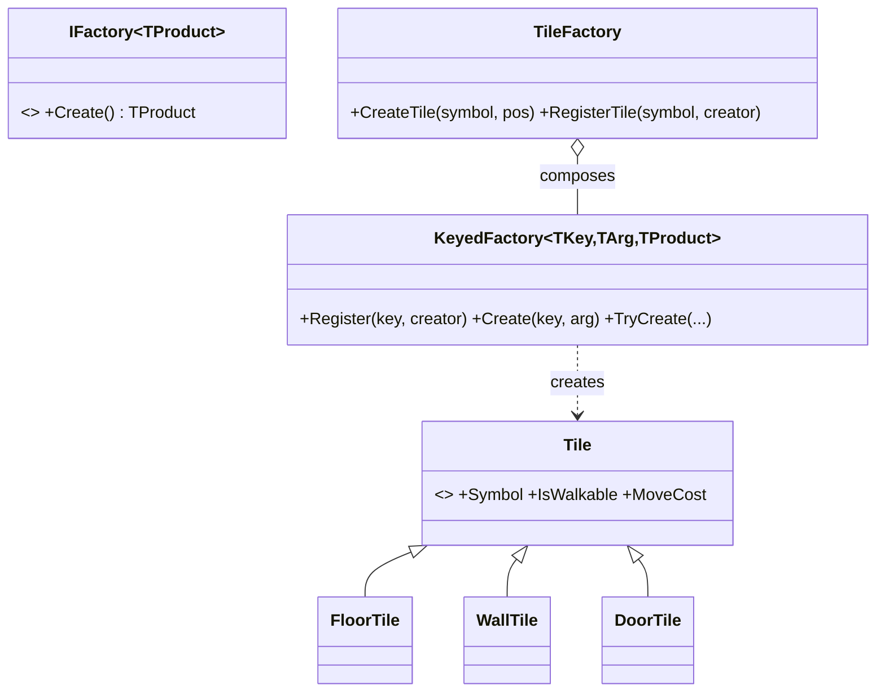

# Factory Pattern

> Ask for a product by key and get the right concrete type back — without the caller knowing which class it is or how it's built.

## Intent

Client code often shouldn't hard-code `new ConcreteThing()`. A factory centralizes that choice: the caller supplies a key (a map symbol, an enum, a string, a `Type`) and receives a product built to the correct concrete type. Swap or add product types in one place; callers never change.

The generic core here is a **registry**: creators are *registered* against keys rather than hard-wired in a `switch`. Adding a product is a `Register` call — the factory is open for extension, closed for modification. (The legacy shape factory this replaced had a `switch` in `GetShape` that every new shape forced you to edit.)



## Structure

| Folder | Assembly | Contents |
|---|---|---|
| `Core/` | `DesignPatterns.Factory` | The generic pattern — pure C#, `noEngineReferences: true`. |
| `Sample/` | `DesignPatterns.Factory.Sample` | A tile factory that turns ASCII-map symbols into `Tile`s + a playable demo. |
| `Tests/` | `DesignPatterns.Factory.Tests` | 26 EditMode tests (Window → General → Test Runner). |

**Core participants:**

- `IFactory<TProduct>` / `IFactory<TArg, TProduct>` — the creator contract, as an object. Use it when a creator needs its own state or dependencies.
- `KeyedFactory<TKey, TProduct>` — the reusable registry: `Register(key, creator)`, then `Create(key)` / `TryCreate` / `CanCreate` / `Keys`. Unknown keys throw `UnknownFactoryKeyException` (or return false via `TryCreate`).
- `KeyedFactory<TKey, TArg, TProduct>` — same registry, but creators take a construction argument (here a grid position).

## Two ways to register a creator

```csharp
var factory = new KeyedFactory<char, Vector2Int, Tile>();
factory.Register('.', pos => new FloorTile(pos));   // a lambda — best for one-liners
factory.Register('+', new DoorTileFactory());       // a factory OBJECT (IFactory) — when it needs state/deps
```

Both end up as creators keyed by symbol. The object form ties the `IFactory` contract into the registry so you can mix styles.

## Run the sample

Open `Sample/Scenes/FactorySample.unity` and press Play. The demo:
1. Parses a small ASCII map and lets `TileFactory` build a `Tile` for each symbol + position.
2. Prints the map rebuilt from the tiles, plus walkable-tile count and total move cost.
3. **Extends the factory at runtime** — `RegisterTile('L', …)` adds a lava tile with no edit to `TileFactory` or `KeyedFactory`.
4. Handles an unknown symbol gracefully via `TryCreateTile`.

## When to use it in games

- **Data-driven spawning** — map symbols, level JSON, or enemy tables naming what to create; the factory maps name → object.
- **Decoupling & testing** — code depends on `IFactory`/`Tile`, so tests can register fakes and production registers the real thing.
- **Open/closed extension** — DLC or mods register new product types without touching shipped factory code.
- **Engine-agnostic logic** — the registry is plain C#; only the products here touch `UnityEngine`.

## Factory vs Builder

Both create objects, but for different reasons: a **factory** picks *which* concrete type to make (one call, keyed choice); a **builder** assembles *one* complex object step by step. Reach for Factory when the decision is "which type?", Builder when it's "how do I configure this one?".

## Pitfalls

- **The `switch`/`if` factory** — the anti-pattern the registry replaces. A growing `switch (type)` means editing the factory for every new product; register creators instead.
- **Leaking concrete types** — if `Create` returns `FloorTile` instead of `Tile`, callers couple to specifics and the abstraction is lost. Return the base type/interface.
- **Doing too much in a creator** — a factory *creates*; it shouldn't also wire the object into the scene, start coroutines, or mutate global state. Keep creation pure.
- **Unknown keys** — decide per call site whether a missing key is exceptional (`Create` throws) or expected (`TryCreate`/`CanCreate`). Don't swallow it silently.
- **Confusing it with a pool** — a factory makes a fresh product each call; if you need reuse, that's Object Pool, layered on top.
