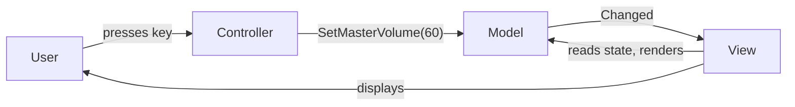

# MVC Pattern (Model–View–Controller)

> Split a screen into three roles — state, display, and input handling — so each can change without dragging the others along.

## Intent

Mixing UI drawing, input handling, and state in one class produces something impossible to test or reskin. MVC separates them:

- **Model** — the state and the rules that keep it valid. Knows nothing about UI.
- **View** — renders the model. Reads state; never changes it.
- **Controller** — turns user intent into model changes. Holds no view.

The round trip: input → **Controller** mutates the **Model** → the model raises `Changed` → the **View** re-renders. Nobody reaches across roles; the model's notification is the only coupling, and it points outward.

## Structure

| Folder | Assembly | Contents |
|---|---|---|
| `Core/` | `DesignPatterns.MVC` | The reusable roles — pure C#, `noEngineReferences: true`. |
| `Sample/` | `DesignPatterns.MVC.Sample` | A game settings screen (volume / difficulty / fullscreen) + a playable demo. |
| `Tests/` | `DesignPatterns.MVC.Tests` | 14 EditMode tests (Window → General → Test Runner). |

**Core participants:**

- `ObservableModel` — model base: raises `Changed` when state actually changes (subclasses call `NotifyChanged()` from their mutators).
- `IView<TModel>` — the render contract; passive, read-only over the model.
- `Controller<TModel>` — controller base: holds the model, exposes intent methods, renders nothing.
- `ViewBinder<TModel>` — the glue: renders once on creation and re-renders on every `Changed`; `Dispose` to unbind (prevents a view outliving its model across scene loads).

Keeping the model→view wiring in `ViewBinder` lets the view stay a pure function of state and the model stay unaware that views exist. (Some MVC variants have the view subscribe to the model directly; this is the same idea with the subscription factored out.)

## Run the sample

Open `Sample/Scenes/MvcSample.unity` and press Play. The initial settings render immediately; then **Up/Down** change volume, **D** cycles difficulty, **F** toggles fullscreen. Each keypress goes through the controller, updates the model, and the view re-renders — and setting a value to what it already is renders nothing, because the model only notifies on a real change.

## MVC vs MVP vs MVVM

These come up constantly in UI code; the difference is *who mediates and how the view learns of changes*:

| | Who handles input | How the view updates | View knows the model? |
|---|---|---|---|
| **MVC** (here) | Controller | View reads the model after a change notification | Yes — view reads model state |
| **MVP** | Presenter | Presenter pushes values into a passive view (`view.SetVolume(60)`) | No — view exposes setters only |
| **MVVM** | Commands on a ViewModel | Data-binding syncs view ↔ ViewModel automatically | No — binds to a ViewModel |

Unity has no built-in MVC framework, so teams pick a flavor by hand; UI Toolkit's data binding pushes you toward MVVM, while classic `uGUI` screens are often MVC/MVP.

## When to use it in games

- **Menus and HUDs** — settings, inventory, shop, character sheet: state that several widgets display and inputs mutate.
- **Testable UI logic** — the model + controller are plain C# (these tests drive them with no scene, no `GameObject`).
- **Reskinnable screens** — swap the `IView` implementation (console, uGUI, UI Toolkit) without touching model or controller.

## Pitfalls

- **Logic leaking into the view** — a view that clamps volume or decides difficulty order is doing the model's/controller's job; keep it a pure renderer.
- **The model reaching back to the view** — if the model calls `view.Render()` directly, you've recoupled them. It only raises `Changed`.
- **A "controller" that's really everything** — the classic Unity `MonoBehaviour` that holds state, reads input, and updates UI is all three roles fused. Splitting them is the point.
- **Forgetting to unbind** — a `ViewBinder` (or a view subscribed to a model) that outlives its screen leaks and renders into destroyed objects. Dispose it (here, in `OnDestroy`).
- **Notifying on non-changes** — re-rendering when nothing changed wastes work and can loop; notify only on a real state change.
