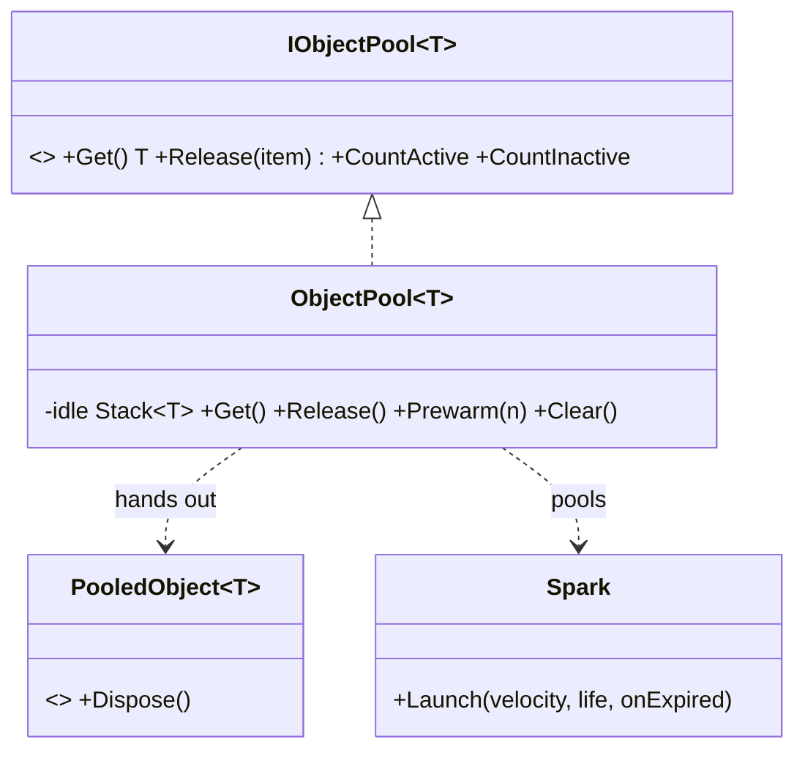

# Object Pool Pattern

> Reuse a bounded set of expensive objects instead of allocating and destroying them constantly.

## Intent

Creating and destroying objects every frame — projectiles, particles, enemies, UI rows — churns memory and triggers garbage-collection hitches. An object pool keeps a set of reusable instances: you **Get** one when you need it and **Release** it when you're done, and the pool recycles it for the next caller. Allocation happens once (or in a warm-up), not on every spawn.



## Structure

| Folder | Assembly | Contents |
|---|---|---|
| `Core/` | `DesignPatterns.ObjectPool` | The generic pool — pure C#, `noEngineReferences: true`. |
| `Sample/` | `DesignPatterns.ObjectPool.Sample` | A spark emitter that pools short-lived particles + a playable demo. |
| `Tests/` | `DesignPatterns.ObjectPool.Tests` | 15 EditMode tests (Window → General → Test Runner). |

**Core participants:**

- `IObjectPool<T>` / `ObjectPool<T>` — the pool. Creation, reset-on-get, reset-on-release, and destruction are supplied as **delegates**, so the same pool serves plain C# objects, Unity components, buffers — anything. Configurable `maxSize` caps idle instances; `collectionCheck` catches double-release.
- `PooledObject<T>` — a disposable borrow scope: `using (pool.Get(out var x)) { … }` releases `x` automatically, so you can't forget.

Counts you can watch: `CountActive` (borrowed), `CountInactive` (idle), `CountAll` (created and tracked).

## Delegate-driven, so it fits anything

```csharp
var pool = new ObjectPool<Spark>(
    createFunc:  CreateSpark,                       // how to make one
    onGet:       s => s.gameObject.SetActive(true), // reset as it's borrowed
    onRelease:   s => s.gameObject.SetActive(false),// reset as it's returned
    onDestroy:   s => Destroy(s.gameObject),        // dispose surplus / on Clear
    maxSize:     64);
pool.Prewarm(16);
```

The pool never mentions `GameObject`, `SetActive`, or `Destroy` itself — those live in the hooks the sample passes. That's why the Core stays engine-free and reusable.

## Run the sample

Open `Sample/Scenes/ObjectPoolSample.unity` and press Play. It emits ~20 sparks/second, each living 1.5s (so ~30 alive at once). The once-per-second log shows the pool created only a small, bounded number of objects (`CountAll`) no matter how many thousands are emitted over time — the recycling is the whole point.

## Unity already ships one

Unity 6 includes `UnityEngine.Pool.ObjectPool<T>` (plus `ListPool<T>`, `DictionaryPool<T>`, …) with the same Get/Release shape. **Prefer the built-in one in production.** This from-scratch version exists to show the mechanics; understanding them tells you when a hand-rolled pool (custom growth, multi-scene ownership, non-Unity types) earns its keep.

## When to use it in games

- **High-churn spawns** — bullets, shells, particles, damage numbers, footstep decals.
- **Expensive construction** — objects whose creation cost (parsing, allocation, `AddComponent`) dwarfs a reset.
- **GC-sensitive loops** — mobile/VR frame budgets where allocation spikes cause stutter.

## Pitfalls

- **Forgetting to Release** — the pool drains, every Get allocates, and you've built a slower allocator. The `using (pool.Get(out var x))` scope prevents it.
- **Using an object after releasing it** — it may already be handed to someone else. Null your reference on release; `collectionCheck` catches the double-release half of this.
- **Not resetting state** — a reused object still carries its old velocity/health/flags. Reset in `onGet` (or `onRelease`), or bugs leak between borrows.
- **Unbounded growth** — without a `maxSize`, a spike creates thousands that never free. Cap it so surplus returns are destroyed.
- **Pooling the wrong things** — cheap, short-lived value-like objects don't benefit; pooling adds complexity for no gain. Pool what's genuinely expensive or high-churn.
