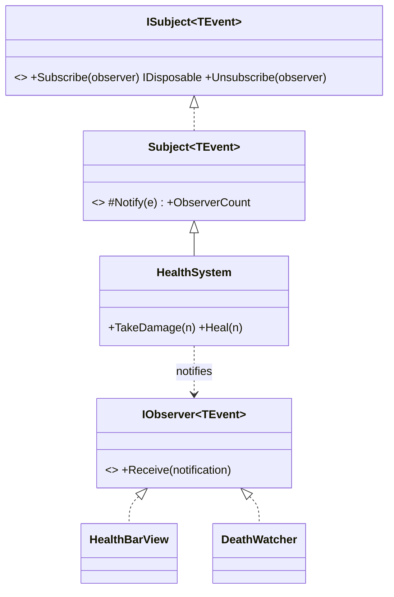

# Observer Pattern

> Let objects react to something changing without the thing that changed knowing who's watching.

## Intent

A `HealthSystem` shouldn't know that a health bar, a low-health screen effect, an achievement tracker, and an audio cue all care when health changes. The Observer pattern inverts that: interested parties **subscribe**, and the subject **broadcasts** to whoever is listening. Add or remove reactions without touching the subject — the core of decoupled, event-driven game code.



## Structure

| Folder | Assembly | Contents |
|---|---|---|
| `Core/` | `DesignPatterns.Observer` | The generic pattern — pure C#, `noEngineReferences: true`. |
| `Sample/` | `DesignPatterns.Observer.Sample` | A HealthSystem with four independent observers + a playable demo. |
| `Tests/` | `DesignPatterns.Observer.Tests` | 24 EditMode tests (Window → General → Test Runner). |

**Core participants:**

- `IObserver<TEvent>` — one command, `Receive(notification)`. (Named after the GoF role; deliberately *not* the BCL's Rx-style `System.IObserver<T>`.)
- `ISubject<TEvent>` / `Subject<TEvent>` — the generic observable base. `Subscribe` returns an `IDisposable`; disposing it unsubscribes. A protected `Notify` lets subclasses broadcast; the outside world can only subscribe.
- `Observable<T>` — a reusable reactive value (a bindable property): set `Value`, and subscribers are told — but only when it actually changes.

## Two reusable shapes, one pattern

- **`Subject<TEvent>`** — when the notification is an *event with data* (here `HealthChanged`, carrying before/after/max so each observer reads what it needs). Multiple observer classes, each reacting differently.
- **`Observable<T>`** — when you're observing *a single value* (score, ammo, a toggle). `health.Subscribe(...)` vs `ammo.Value = 3`. Same idea, lighter ceremony; bind UI directly with `Subscribe(onChanged, notifyImmediately: true)`.

## Subscriptions that clean themselves up

`Subscribe` returns an `IDisposable`. Two consequences that matter in real games:

```csharp
IDisposable sub = health.Subscribe(new CombatLog());
// ...later...
sub.Dispose();   // unsubscribed — no leak, no dangling callback
```

Forgetting to unsubscribe is the #1 Observer bug (dead objects still receiving events, especially across scene loads). A disposable token is far harder to forget than a matching manual `Unsubscribe`, and it composes with Unity lifecycle (dispose in `OnDestroy`).

## Run the sample

Open `Sample/Scenes/ObserverSample.unity` and press Play. One `HealthSystem` feeds four observers — a health-bar view, an edge-triggered low-health warning, a self-removing death watcher, and a lambda observer — through a damage/heal fight. Watch the combat log unsubscribe partway (its token is disposed) and the death watcher remove itself the instant health hits zero.

## When to use it in games

- **Decoupled reactions** — health/score/state changes fanning out to UI, audio, VFX, analytics, achievements.
- **Reactive values** — `Observable<T>` for anything a HUD mirrors (ammo, coins, timer).
- **Domain events** — "enemy died", "level loaded", "item equipped" broadcast to many systems.
- **Editor-agnostic core** — the subject is plain C#, so game logic stays testable outside the engine (these tests do exactly that).

## Pitfalls

- **Mutating the observer list mid-broadcast.** If an observer unsubscribes (or subscribes) while being notified and the subject loops the live list, observers get skipped. `Subject<TEvent>.Notify` iterates a **snapshot** to prevent this — the exact bug in the repo's old score/achievement sample, whose `Achievement` detached itself inside an index-based `for` loop and silently skipped the next observer.
- **Forgetting to unsubscribe** — the classic leak. Prefer the disposable token; dispose it when the observer's owner is destroyed.
- **Notifying on non-changes** — spamming observers when nothing changed. `HealthSystem` and `Observable<T>` both suppress no-op updates.
- **Observers depending on call order** — a subject guarantees *that* everyone is notified, not the order or what other observers do. Keep observers independent.
- **Doing heavy work in `Receive`** — notifications are synchronous; a slow observer stalls every other observer and the subject. Keep reactions light or defer them.
