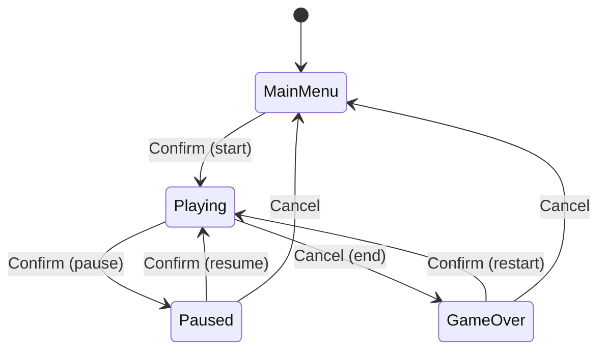

# State Pattern

> Let an object change its behavior when its internal state changes — as if it changed its class — instead of branching on a state variable everywhere.

## Intent

Anything with modes — a game's flow, an enemy's AI, a door, a network connection — tends to accumulate `switch (state)` blocks in every method, and they drift out of sync. The State pattern gives each state its own class that defines how the object behaves *and* which state comes next. Swapping the current-state object swaps the behavior; there's no central conditional to keep consistent.

The demo makes this vivid: the **same input** does something different in every state.

## Structure

| Folder | Assembly | Contents |
|---|---|---|
| `Core/` | `DesignPatterns.State` | The generic state machine — pure C#, `noEngineReferences: true`. |
| `Sample/` | `DesignPatterns.State.Sample` | A game-flow machine (Menu/Playing/Paused/GameOver) + a playable demo. |
| `Tests/` | `DesignPatterns.State.Tests` | 16 EditMode tests (Window → General → Test Runner). |

**Core participants:**

- `IState<TContext>` — `Enter` / `Update` / `Exit`, each handed the machine so a state can read `machine.Context` and call `machine.ChangeState(...)`.
- `State<TContext>` — base with no-op virtuals, so a state overrides only what it needs.
- `StateMachine<TContext>` — holds the context and current state, drives the `Exit → Enter` handshake on every transition, ticks the current state via `Update()`, exposes `IsInState<T>()`, and raises `StateChanged(from, to)`.

Generic over the context, so the same machine runs a game's flow, an enemy brain, or a UI wizard.

## Run the sample

Open `Sample/Scenes/StateSample.unity` and press Play. Two keys drive everything:
- **Enter** = Confirm — *start* in the menu, *pause* while playing, *resume* while paused, *play again* after game over.
- **Esc** = Cancel — *end the run* while playing (banking the high score), *back out* from pause or game over.

While playing, the score climbs each tick; pausing preserves it, restarting resets it. All of that flow logic lives in the state classes — the demo only turns key presses into commands and logs the transitions it hears via `StateChanged`.

## Why not just an enum + switch?

A single `enum State` with `switch` statements in `Update`, `HandleInput`, `Render`, … means every method must handle every state, and adding a state edits them all. With the State pattern each state is one cohesive class, transitions are explicit (`ChangeState`), and adding a state is adding a class — the other states don't change. The trade-off is more classes; worth it once the branching gets real.

## When to use it in games

- **Game/screen flow** — menu, playing, paused, cutscene, game over (this sample).
- **Enemy & NPC AI** — patrol / chase / attack / flee, each with its own logic and exits.
- **Character controllers** — grounded / jumping / dashing / stunned, where inputs mean different things per state.
- **Connection / loading** — disconnected / connecting / connected / retrying.

## Pitfalls

- **The `switch` creeping back in** — if a state inspects "what state am I?" you've reintroduced the conditional. Let polymorphism do it.
- **Shared state in the wrong place** — data that outlives a single state (score, health) belongs on the **context**, not on a state object that gets replaced on every transition.
- **Transition side-effects in the wrong spot** — "start a new game resets the score" but "resume" doesn't; put per-transition effects at the source (the menu/game-over states reset; resume doesn't) so one state's `Enter` doesn't wrongly reset for another path into it.
- **States reaching into each other** — a state should know which state comes *next*, not poke another state's internals. Communicate through the context.
- **Forgetting Exit** — cleanup (stop a timer, hide UI) belongs in `Exit`; skipping it leaks behavior into the next state. The machine always runs `Exit` before `Enter`.
